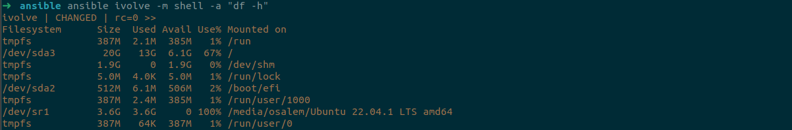

# Lab4 Ansible Installation and Basic Configuration

## Overview

This document outlines the steps to install and configure the Ansible Automation Platform on a control node, set up a managed node, and verify functionality.

## Steps:

### 1. **Install and configure Ansible Automation Platform on control node.**

RedHat:
```bash
sudo dnf install -y ansible-core
```

Debian 
```bash
sudo apt install -y ansible
```
### **Make sure that the target node has python installed**

### 2. **Create inventory of a managed node.**
Create an inventory file (e.g., `inventory`) listing the managed node(s).

Example content:

```
[web]
ivolve ansible_host=192.168.79.134 ansible_user=root
```
### 2. **Create Ansible Configuration file (`ansible.cfg`)**

Create a configuration file called `ansible.cfg`.

```
[defaults]
inventory = ~/ansible/inventory
remote_user = root
```
### Generating and Transfaring the Key was done in Linux Lab3

### 3. **Perform ad-hoc command (check disk space) to check functionality.**

Run an Ansible ad-hoc command to check disk space on the managed node.
```bash
ansible ivolve  -m shell -a "df -h"
```
### Result

