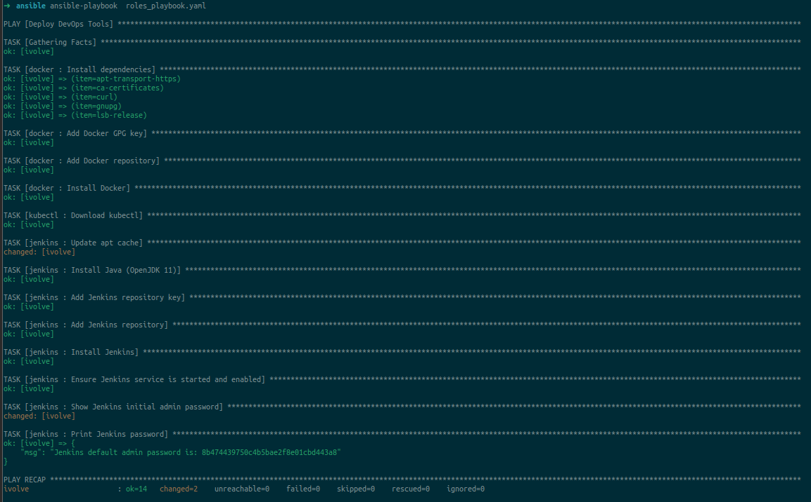
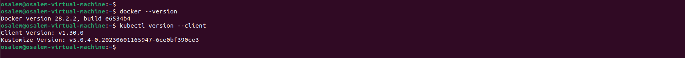
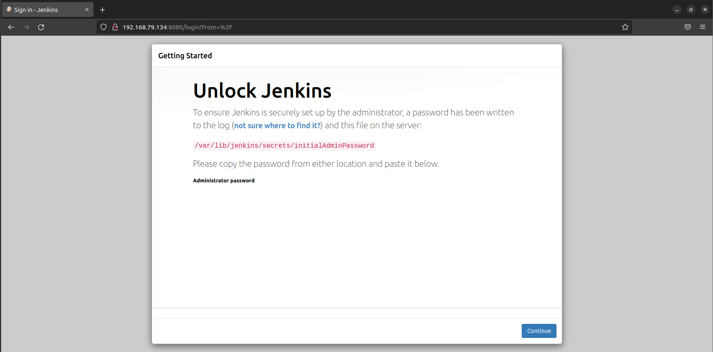

# Lab 6: Ansible Roles for Application Deployment

This repository contains Ansible roles and playbooks for installing and managing Docker, Kubernetes CLI ('kubectl'), and Jenkins on a managed node.

### Objectives
- Create an Ansible role for installing Docker, Kubernetes CLI ('kubectl'), and Jenkins.
- Write Ansible playbook to run the created roles.
- Verify the installation on managed node.

### Role Directory Structure

```
roles/
├── docker/
│    └── tasks/
|        └── main.yml
├── kubectl/
│    └── tasks/
|        └── main.yml
├── jenkins/
│    └── tasks/
|        └── main.yml
```

### Setup Instructions
#### 1. Ensure Ansible is installed on the control node.
#### 2. Clone this repository to your local machine.
#### 3. Update the inventory file with the managed node's IP address.
#### 4. add the role path and the default role paths to `ansible.cfg`
```
roles_path = ~/roles:/usr/share/ansible/roles:/etc/ansible/roles
```
#### 4. Run the playbook using the command: 

```bash
ansible-playbook roles_playbook.yml
```



### Role Details
- **Docker Role**: Installs Docker and ensures it is running and enabled.
- **Kubectl Role**: Installs the Kubernetes CLI and configures it.
- **Jenkins Role**: Installs Jenkins and sets up the initial admin password.

### Playbook Details
- The `deploy.yml` playbook applies the Docker, kubectl, and Jenkins roles sequentially to the managed node.

### Verification
####  After running the playbook, verify the installations:
  - Check Docker: `docker --version`

  - Check kubectl: `kubectl version --client`
  
  - Check Jenkins: Access Jenkins web interface at `http://<managed_node_ip>:8080` and use the initial admin password printed on the terminal screen.
  


