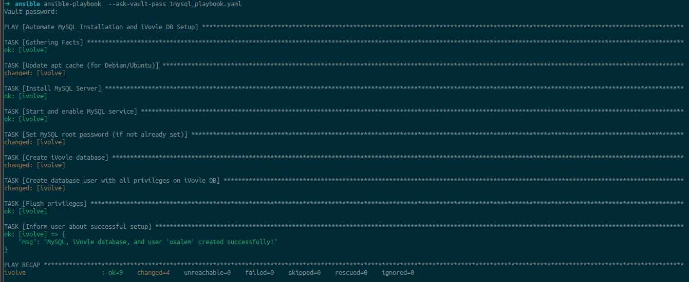
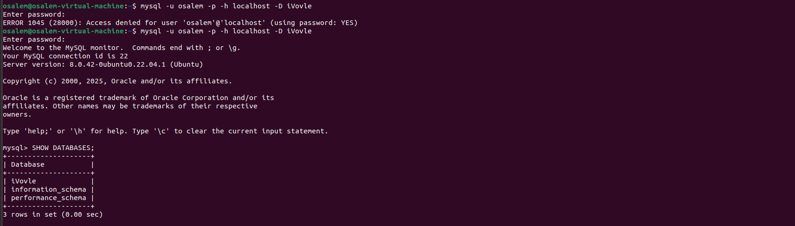

# Lab 7: Ansible Vault Documentation

## Overview
This README provides detailed documentation for the Ansible playbook designed to automate the setup of a MySQL server, creation of an `iVovle` database, and configuration of a database user with appropriate privileges. The playbook utilizes Ansible Vault to encrypt sensitive information such as database passwords.

## Playbook Details
- **Playbook Name**: `mysql_playbook.yaml`
- **Purpose**: Automate MySQL installation and database setup on a managed node.
- **Hosts**: Targets the `web` group of hosts.
- **Privileges**: Requires `become: yes` for elevated permissions.

## Tasks Performed
1. **Update apt cache**: Ensures the package cache is up-to-date on Debian/Ubuntu systems.
2. **Install MySQL Server**: Installs the MySQL server package.
3. **Start and enable MySQL service**: Ensures the MySQL service is running and enabled on boot.
4. **Set MySQL root password**: Configures the root password if not already set.
5. **Create iVovle database**: Creates a database named `iVovle`.
6. **Create database user with all privileges**: Sets up a user with full privileges on the `iVovle` database.
7. **Flush privileges**: Applies the privilege changes.
8. **Inform user**: Provides a confirmation message upon successful setup.

## Variables
- **vars.yml**: Contains general variables such as `mysql_db_name` and `mysql_db_user`.
- **vault.yml**: Stores encrypted sensitive data like `mysql_root_password` and `mysql_db_password` using Ansible Vault.


## Prerequisites
- Ansible installed on the control node.
- Access to a managed node in the `web` group.
- MySQL community module installed (`community.mysql` collection).
- Ansible Vault configured with a vault password file.

## Usage
1. Ensure the `vars.yml` and `vault.yml` files are created and properly configured.
   - Encrypt `vault.yml` using `ansible-vault encrypt vault.yml` with a vault password.

   - To use ansible vault apply the following command:
      ```bash
      ansansible-vault create vault.yml
      ```
   - you will be asked to enter vault's password

2. Run the playbook with the following command:
   ```bash
   ansible-playbook --ask-vault-pass mysql_playbook.yaml
   ```
   - Use `--ask-vault-pass` to input the vault password interactively.

### Result



## Validation
- Connect to the MySQL database on the managed node using the created user and list databases to verify the setup.
- Command:
   ```bash
   mysql -u <mysql_db_user> -h localhost -p <mysql_db_password> -e "SHOW DATABASES;"
   ```
  ```bash
  mysql -u osalem -h localhost  -p -e "SHOW DATABASES;"
  ```
  - Enter the user password.
  - Ensure the `iVovle` database is listed.



## Notes
- The `host: "%"` setting allows the database user to connect from any host. For production, restrict this to specific IPs.
- Always secure the vault password and limit access to the `vault.yml` file.
