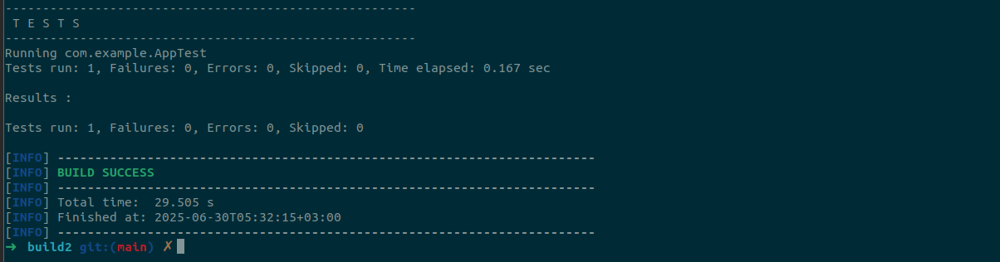
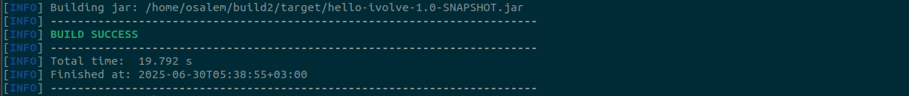
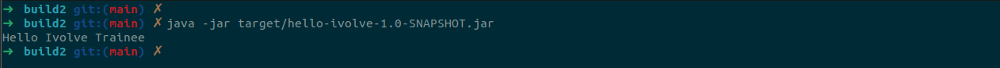

# Lab 10: Build Java App using Maven

This guide provides step-by-step instructions to build and run a Java application using Maven. The application source code is hosted on GitHub, and the process includes installing Maven, cloning the repository, running unit tests, building the application, and verifying its functionality.

## Prerequisites
- Java Development Kit (JDK) installed
- Internet connection to clone the repository and download dependencies

## Steps

### 1. Install Maven
- Download and install Apache Maven from the [official Maven website](https://maven.apache.org/download.cgi).
- Follow the installation instructions for your operating system to set up Maven.
- Verify the installation by running `mvn -version` in your terminal or command prompt.

### 2. Clone Source Code
- Clone the repository using the following command:
  ```
  git clone https://github.com/Ibrahim-Adel15/build2.git
  ```
- Navigate to the project directory:
  ```
  cd build2
  ```

### 3. Run Unit Test
- Execute the following command to run the unit tests:
  ```
  mvn test
  ```
- Ensure all tests pass successfully. Review the output for any failures or errors.
  
  

### 4. Build App [generate Artifact (target/hello-ivolve-1.0-SNAPSHOT.jar)]
- Build the application and generate the artifact by running:
  ```
  mvn package
  ```
- This command compiles the code, runs tests, and creates a JAR file named `hello-ivolve-1.0-SNAPSHOT.jar` in the `target` directory.
- Verify the JAR file is created in the `target` folder.
  
  


### 5. Run App
- Run the application using the following command:
  ```
  java -jar target/hello-ivolve-1.0-SNAPSHOT.jar
  ```


- The application should start, and you can observe its output in the terminal.
  
  


