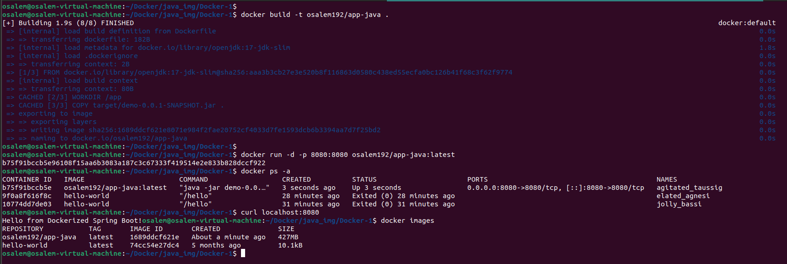

# Running Java Spring Boot App in a Container

This guide provides two methods to run a Java Spring Boot application in a Docker container: one where the code is built inside the container, and another where the code is built outside and copied into the container.

## Prerequisites
- Docker installed on your system.
- Git installed to clone the repository.
- Maven installed (for the second method).

## Steps

### Method 1: Building the Code Inside the Container
1. **Clone the Application Code**
   Clone the repository from the following link:
   ```Bash
   https://github.com/Ibrahim-Adel15/Docker-1.git
   ```

2. **Write Dockerfile**
   Create a `Dockerfile` with the following content:
   - Use Maven base image with Java 17.
   - Create work directory.
   - Copy the application code into the container.
   - Build the app using `mvn package`.
   - Run the app on jar file located in `target/demo-0.0.1-SNAPSHOT.jar`.
   - Expose port 8080.
   ```Dockerfile
    FROM maven:3.9.10-eclipse-temurin-17-alpine

    WORKDIR /app

    COPY . .

    RUN mvn package

    CMD [ "java" , "-jar" , "target/demo-0.0.1-SNAPSHOT.jar"]

    EXPOSE 8080
   ```

3. **Build Image**
   Build the Docker image using the following command:
   ```Bash
   docker build -t spring-boot-app .
   ```

4. **Run Container**
   Run the container with the following command:
   ```Bash
   docker run -p 8080:8080 spring-boot-app
   ```

5. **Test the Application**
   Open a browser or use a tool like `curl` to test the application at `http://localhost:8080`.

6. **Stop and Delete the Container**
   Stop the running container with:
   ```
   docker stop <container_id>
   ```
   Delete the container with:
   ```
   docker rm <container_id>
   ```

### Method 2: Building the Code Outside the Container
1. **Clone the Application Code**
   Clone the repository from the following link:
   ```
   https://github.com/Ibrahim-Adel15/Docker-1.git
   ```

2. **Build the Application Locally**
   Navigate to the project directory and build the application using Maven:
   ```
   cd /path/to/project
   mvn package
   ```
   This will generate the `demo-0.0.1-SNAPSHOT.jar` file in the `target` directory.

3. **Write Dockerfile**
   Create a `Dockerfile` with the following content:
   - Use OpenJDK 17 base image.
   - Create work directory.
   - Copy the pre-built jar file into the container.
   - Expose port 8080.
   - Run the app on the copied jar file.
   ```Dockerfile
    FROM openjdk:17-jdk-slim

    WORKDIR /app

    COPY target/demo-0.0.1-SNAPSHOT.jar .

    CMD [ "java" , "-jar", "demo-0.0.1-SNAPSHOT.jar" ]

    EXPOSE 8080
   ```

4. **Build Image**
   Build the Docker image using the following command:
   ```
   docker build -t java-app .
   ```

5. **Run Container**
   Run the container with the following command:
   ```
   docker run -p 8080:8080 java-app
   ```

6. **Test the Application**
   Open a browser or use a tool like `curl` to test the application at `http://localhost:8080`.

7. **Stop and Delete the Container**
   Stop the running container with:
   ```
   docker stop <container_id>
   ```
   Delete the container with:
   ```
   docker rm <container_id>
   ```

## Build and Image Size



## Notes
- Ensure the application builds successfully before creating the Docker image in both methods.
- Adjust the port mapping (`-p 8080:8080`) if port 8080 is already in use.
- For Method 2, ensure the `target/demo-0.0.1-SNAPSHOT.jar` file is present before building the image.