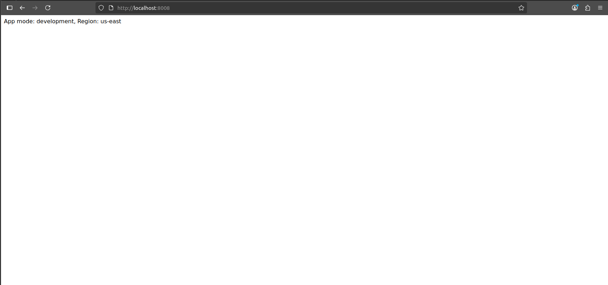
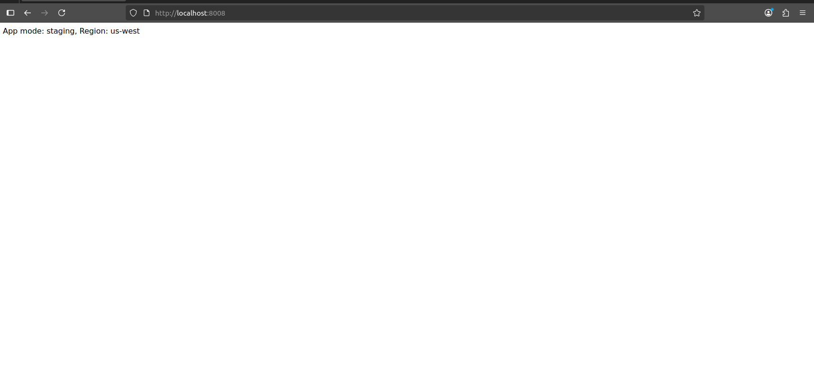
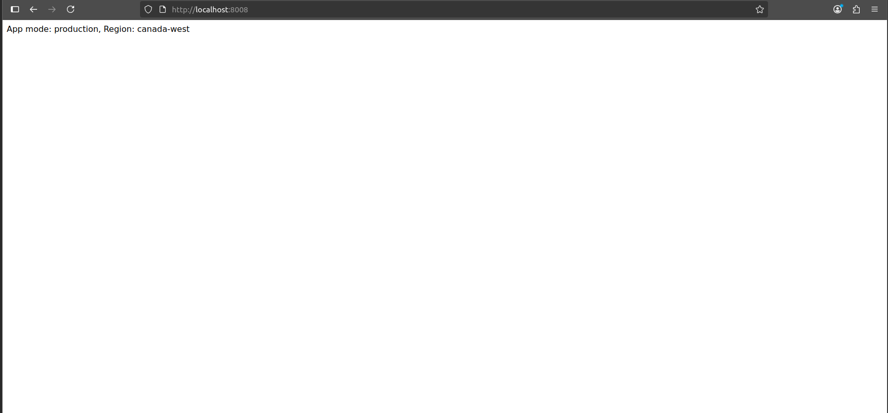

# Docker Environment Variables Lab

## Overview
This project demonstrates how to set up and manage Docker environment variables for a Flask application. The lab includes cloning the application code, creating a Dockerfile, building a Docker image, and running containers with different environment variables.


## Prerequisites
- Docker installed on your system
- Git for cloning the repository
- Basic knowledge of Docker and Flask


## Steps

### 1. Clone the Application Code
Clone the repository containing the application code from the following GitHub URL:
```
https://github.com/Ibrahim-Adel15/Docker-3.git
```

### 2. Write Dockerfile
Create a `Dockerfile` with the following specifications:
- Use the `python` image
- Install `flask`
- Expose port `8080`
- Run the `python` command on `app.py`

### 3. Build Docker Image
Build the Docker image using the `Dockerfile` with the following command:
```bash
docker build -t flask-app .
```

### 4. Run Container and Set Environment Variables
Run the Docker container and set the environment variables `APP_MODE` and `APP_REGION` as follows:

#### i. Development (us-east)
Run the container with the following command, setting the variables directly:
```bash
docker run -e APP_MODE=development -e APP_REGION=us-east flask-app
```

#### Output


#### ii. Staging (us-west)
Create a separate environment file (e.g., `.env`) with the following content:
```
APP_MODE=staging
APP_REGION=us-west
```
Run the container and pass the file name in the command:
```bash
docker run --env-file .env -p 8080:8080 flask-app
```
#### Output



#### iii. Production (canada-west)
Edit the `Dockerfile` to include the environment variables directly:
```
ENV APP_MODE=production
ENV APP_REGION=canada-west
```
Build and run the container:
```bash
docker run -p 8080:8080 flask-app
```
#### Output

