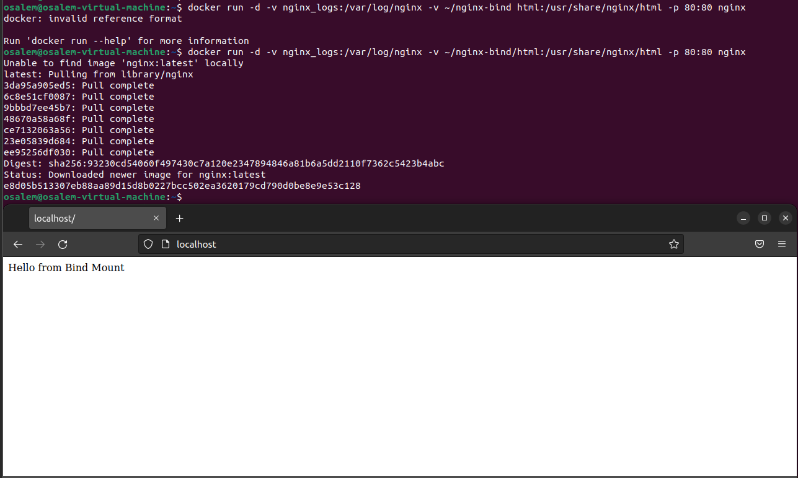
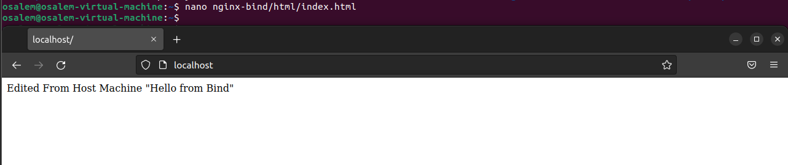

# Lab 14: Docker Volume and Bind Mount with Nginx

This lab demonstrates how to use Docker volumes and bind mounts with an Nginx container to persist logs and serve custom HTML content from your host machine.

## Steps

### 1. Create a Docker Volume for Nginx Logs
Create a volume named `nginx_logs` to persist Nginx logs:
```sh
docker volume create nginx_logs
```

### 2. Create a Directory for Bind Mount
Create a directory on your host to serve custom HTML files:
```sh
mkdir -p nginx-bind/html
```

### 3. Create a Custom HTML File
Create an `index.html` file with the following content:
```html
Hello from Bind Mount
```

### 4. Run the Nginx Container
Run the Nginx container with:
- Volume for `/var/log/nginx` (logs)
- Bind mount for `/usr/share/nginx/html` (web content)

```sh
docker run -d -v nginx_logs:/var/log/nginx -v ~/nginx-bind html:/usr/share/nginx/html -p 80:80 nginx
```

### 5. Verify Nginx Page
Check the Nginx page from your local machine:
```sh
curl http://localhost
```
You should see:
```
Hello from Bind Mount
```
### Running and Verifying The Container:



### 6. Update the HTML File
Edit `nginx-bind/html/index.html` and change its content. Then run the curl command again to verify the change is reflected.

### Verify After HTML Edit


### 7. Verify Logs in the Volume
Check that Nginx logs are stored in the `nginx_logs` volume:
```sh
docker run --rm -it -v nginx_logs:/logs alpine sh
ls /logs
cat /logs/access.log
```

### 8. Delete the Volume
After stopping and removing the container, delete the volume:
```sh
docker rm -f nginx-lab14

docker volume rm nginx_logs
```
