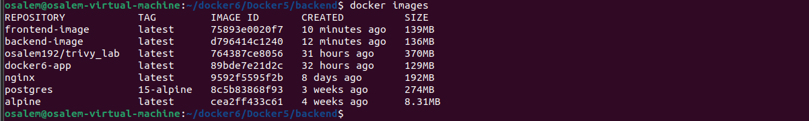
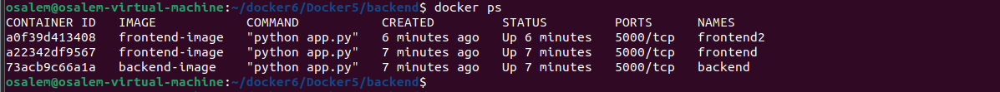
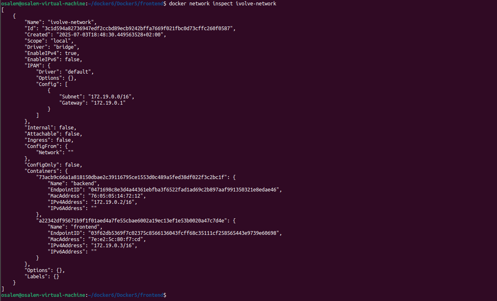

# Lab 15: Custom Docker Network for Microservices

## Objective

Learn how to:
- Build Docker images for frontend and backend microservices.
- Create and use a custom Docker network.
- Run and connect containers using custom and default networks.
- Verify inter-container communication.

---

## Prerequisites

- Docker installed on your system.
- Git installed to clone repositories.
- Basic knowledge of Docker and Python.

---

## Steps

### 1. Clone the Frontend and Backend Code

Clone the sample microservices repository:

```bash
git clone https://github.com/Ibrahim-Adel15/Docker5.git
cd Docker5
```

---

### 2. Write Dockerfile for Frontend

Create a `Dockerfile` in the `frontend` directory with the following content:

```Dockerfile
# Use Python image
FROM python:3.8-slim

# Set working directory
WORKDIR /app

# Copy requirements and install packages
COPY requirements.txt .
RUN pip install -r requirements.txt

# Copy application code
COPY . .

# Expose port 5000
EXPOSE 5000

# Run the app
CMD ["python", "app.py"]
```

Build the frontend image:

```bash
docker build -t frontend-image ./frontend
```

---

### 3. Write Dockerfile for Backend

Create a `Dockerfile` in the `backend` directory with the following content:

```Dockerfile
# Use Python image
FROM python:3.8-slim

# Set working directory
WORKDIR /app

# Install Flask
RUN pip install flask

# Copy application code
COPY . .

# Expose port 5000
EXPOSE 5000

# Run the app
CMD ["python", "app.py"]
```

Build the backend image:

```bash
docker build -t backend-image ./backend
```
### Verify Images


---

### 4. Create a Custom Docker Network

Create a new network called `ivolve-network`:

```bash
docker network create ivolve-network
```

---

### 5. Run Backend Container Using Custom Network

```bash
docker run -d --name backend --network ivolve-network backend-image
```

---

### 6. Run Frontend Container (frontend1) Using Custom Network

```bash
docker run -d --name frontend1 --network ivolve-network frontend-image
```

---

### 7. Run Another Frontend Container (frontend2) Using Default Network

```bash
docker run -d --name frontend2 frontend-image
```
### Running Containers


### Network Inspect

---

### 8. Verify Communication Between Containers

- Containers on the same network (`ivolve-network`) can communicate using container names.
- Try to access the backend from `frontend1` (should work).
- Try to access the backend from `frontend2` (should fail, as it's on the default network).

To test, you can exec into the containers and use `curl`:

```bash
docker exec -it frontend1 sh
# Inside container:
curl http://backend:5000
```

```bash
docker exec -it frontend2 sh
# Inside container:
curl http://backend:5000
# This should fail
```
***`Note The Image We Used Doesn't Have Curl So this Method Won't Work !`***
---

### 9. Delete the Custom Network

After testing, clean up:

```bash
docker network rm ivolve-network
```