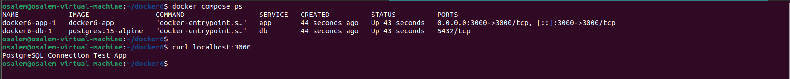

# Docker Compose for Node.js + PostgreSQL App

This repository contains a Docker Compose setup for a Node.js application with a PostgreSQL database. The configuration is based on the project available at [https://github.com/Ibrahim-Adel15/docker6.git](https://github.com/Ibrahim-Adel15/docker6.git).

## Overview

The `docker-compose.yml` file defines the following services and configurations:

### 1. App Service (Node.js Application)
- Builds the image from the provided Dockerfile in the cloned directory.
- Exposes port 3000.
- Depends on the `db` service to ensure PostgreSQL is ready before the app starts.
- Uses the `mynet` network.

### 2. DB Service (PostgreSQL Database)
- Make `.env` file to store the following environment variables:
  - `POSTGRES_USER: postgres`
  - `POSTGRES_PASSWORD: postgres`
  - `POSTGRES_DB: postgres`
- Uses the image: `postgres:15-alpine`.

- Mounts a volume `postgres_data` for data persistence at `/var/lib/postgresql/data`.
- Uses the `mynet` network.

### 3. Volumes
- `postgres_data` is defined as a volume for persistent storage.

### 4. Networks
- `mynet` is defined as a network for service communication.

## Setup Instructions

1. **Clone the Repository**
   - Clone the repository using the command:
     ```bash
     git clone https://github.com/Ibrahim-Adel15/docker6.git
     ```
   - Navigate to the cloned directory:
     ```bash
     cd docker6
     ```

2. **Start the Services**
   - Run the following command to start the application and database:
     ```bash
     docker compose up -d
     ```
   - The `-d` flag runs the containers in detached mode.

3. **Verify the Setup**
   - Check the status of the containers:
     ```bash
     docker compose ps
     ```
   - Access the Node.js app at `http://localhost:3000`.
   - Connect to the PostgreSQL database using the credentials defined in the environment variables.

4. **Stop the Services**
   - To stop the services, run:
     ```bash
     docker-compose down
     ```

## Output



## Notes
- Ensure Docker and Docker Compose are installed on your system.
- The volume `postgres_data` ensures that database data persists across container restarts.