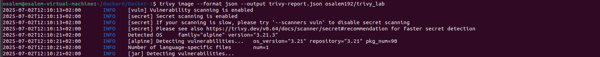
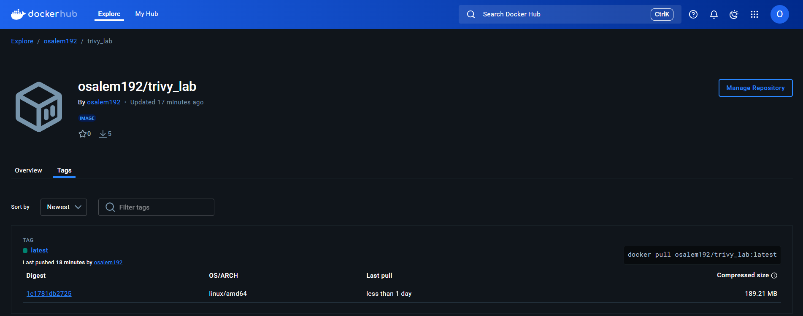

# Lab 17: Scan Docker Image with Trivy

This document outlines the steps to scan a Docker image using Trivy based on the provided lab instructions.

## Prerequisites
- Docker installed and running
- DockerHub account for pushing the image
- Maven installed (if building locally)
- Git installed

## Steps

### 1. Install Trivy
- Install Trivy by following the instructions at: [https://trivy.dev/latest/getting-started/installation/](https://trivy.dev/latest/getting-started/installation/)

### 2. Clone the Application Code
- Clone the repository from: [https://github.com/Ibrahim-Adel15/Docker-1.git](https://github.com/Ibrahim-Adel15/Docker-1.git)
- Navigate to the cloned directory: `cd Docker-1`

### 3. Write a Dockerfile Like Lab12 

### 4. Build Image
- Build the Docker image using the command: 
```bash
docker build -t <your-username>/trivy_lab
```
### 5. Scan Image and Save the Report in JSON Format
- Scan the image with Trivy and save the report: 
```bash
trivy image -f json -o report.json <your-username>/trivy_lab
```



### 6. Push Image into your DockerHub
- Login to DockerHub.
- Push the image to DockerHub: 
```bash
docker push <your-username>/trivy_lab:latest
```


## Notes
- Replace `<your-username>` with your DockerHub username.
- Verify the Trivy report (`report.json`) for any vulnerabilities.