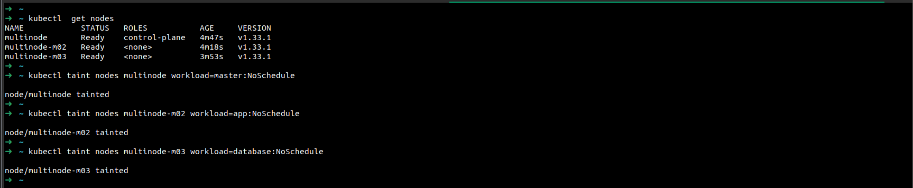
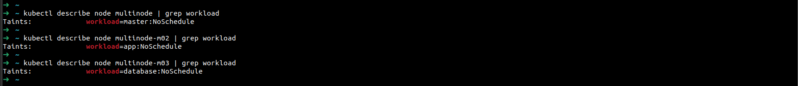

# Lab 19: Node Isolation Using Taints in Kubernetes

This lab demonstrates how to use taints in Kubernetes to isolate workloads on specific nodes. You will:
- Run a Kubernetes cluster with 3 nodes (using Minikube, KubeAdm, EKS, etc.)
- Taint each node with a specific key-value pair and effect
- Verify the taints on all nodes

## Steps

### 1. Run a Kubernetes Cluster with 3 Nodes
You can use any Kubernetes setup (Minikube, KubeAdm, EKS, etc.) as long as you have 3 nodes. For example, with Minikube:
```sh
minikube start --nodes=3 -p multinode
```
Or with kubeadm, ensure you have 3 nodes joined to your cluster.

### 2. List All Nodes
```sh
kubectl get nodes
```
Take note of the node names (in my case, `multinode`, `multinode-m01`, `multinode-m02`).

### 3. Taint the Nodes

#### Taint the First Node (workload=master)
```sh
kubectl taint nodes <node1-name> workload=master:NoSchedule
```

#### Taint the Second Node (workload=app)
```sh
kubectl taint nodes <node2-name> workload=app:NoSchedule
```

#### Taint the Third Node (workload=database)
```sh
kubectl taint nodes <node3-name> workload=database:NoSchedule
```

Replace `<node1-name>`, `<node2-name>`, and `<node3-name>` with the actual node names from your cluster.



### 4. Verify the Taints
Describe each node to verify the taints:
```sh
kubectl describe node <node1-name>
kubectl describe node <node2-name>
kubectl describe node <node3-name>
```
Look for the `Taints` section in the output. It should show the taint you applied to each node.



---

**Note:**
- The `NoSchedule` effect means that no pod will be scheduled on the node unless it tolerates the taint.
- You can remove a taint with:
  ```sh
  kubectl taint nodes <node-name> workload-
  ``` 