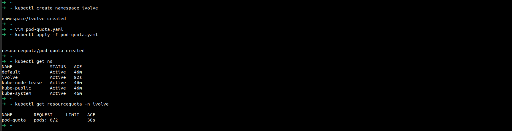

# Lab 20: Namespace Management and Resource Quota Enforcement

## Objective
- Create a namespace called **ivolve**.
- Apply a resource quota to limit the number of pods to only **2 pods** within the namespace.

---

## Step 1: Create the Namespace

You can create a namespace using a YAML manifest or directly with `kubectl`.

### Using kubectl command:
```sh
kubectl create namespace ivolve
```

### Using a YAML manifest:
Create a file named `namespace-ivolve.yaml` with the following content:
```yaml
apiVersion: v1
kind: Namespace
metadata:
  name: ivolve
```
Apply it with:
```sh
kubectl apply -f namespace-ivolve.yaml
```

---

## Step 2: Apply Resource Quota to Limit Pods

Create a file named `pod-quota.yaml` with the following content:
```yaml
apiVersion: v1
kind: ResourceQuota
metadata:
  name: pod-quota
  namespace: ivolve
spec:
  hard:
    pods: "2"
```
Apply the resource quota with:
```sh
kubectl apply -f pod-quota.yaml
```

## Step 3: Verification

### Check the namespace:
```sh
kubectl get namespaces
```

### Check the resource quota in the namespace:
```sh
kubectl get resourcequota -n ivolve
```

### Describe the resource quota for more details:
```sh
kubectl describe resourcequota pod-quota -n ivolve
```



## Notes
- Any attempt to create more than 2 pods in the `ivolve` namespace will be denied by Kubernetes.
- You can modify the quota by editing the `pod-quota.yaml` file and reapplying it. 