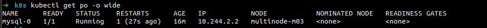

# Lab 23: StatefulSet Deployment with Headless Service

This lab demonstrates how to deploy MySQL using a Kubernetes StatefulSet with a headless service, persistent storage, secrets, and tolerations.

---

## 1. Create a Secret for MySQL Root Password

First, create a Kubernetes Secret to store the MySQL root password.

```yaml
apiVersion: v1
kind: Secret
metadata:
  name: mysql-root-pass
stringData:
  MYSQL_ROOT_PASSWORD: my-secret-password
```
Apply with:
```sh
kubectl apply -f mysql-secret.yaml
```

---

## 2. Create a Persistent Volume Claim (PVC)

Create a PVC to provide persistent storage for MySQL data.

```yaml
apiVersion: v1
kind: PersistentVolumeClaim
metadata:
  name: mysql-pvc
spec:
  accessModes:
    - ReadWriteOnce
  resources:
    requests:
      storage: 1Gi
```
Apply with:
```sh
kubectl apply -f mysql-pvc.yaml
```

---

## 3. Create a StatefulSet for MySQL

This StatefulSet will:
- Run 1 replica of MySQL
- Use the Secret for the root password
- Add a toleration for `workload=database:NoSchedule`
- Mount the PVC to `/var/lib/mysql`

```yaml
apiVersion: apps/v1
kind: StatefulSet
metadata:
  name: mysql
spec:
  serviceName: "mysql"
  replicas: 1
  selector:
    matchLabels:
      app: mysql
  template:
    metadata:
      labels:
        app: mysql
    spec:
      tolerations:
      - key: "workload"
        operator: "Equal"
        value: "database"
        effect: "NoSchedule"
      containers:
      - name: mysql
        image: mysql:8.0
        ports:
        - containerPort: 3306
          name: mysql
        env:
        - name: MYSQL_ROOT_PASSWORD
          valueFrom:
            secretKeyRef:
              name: mysql-root-pass
              key: MYSQL_ROOT_PASSWORD
        volumeMounts:
        - name: mysql-pvc
          mountPath: /var/lib/mysql
  volumeClaimTemplates:
  - metadata:
      name: mysql-pvc
    spec:
      accessModes: [ "ReadWriteOnce" ]
      resources:
        requests:
          storage: 1Gi
```
Apply with:
```sh
kubectl apply -f mysql-statefulset.yaml
```



---

## 4. Create a Headless Service

A headless service (with `clusterIP: None`) is required for StatefulSets.

```yaml
apiVersion: v1
kind: Service
metadata:
  name: mysql
spec:
  clusterIP: None
  selector:
    app: mysql
  ports:
  - port: 3306
    name: mysql
```
Apply with:
```sh
kubectl apply -f mysql-headless-service.yaml
```


## 5. Verification

- Check StatefulSet and pod status:
  ```sh
  kubectl get statefulset,pods,pvc
  ```
- Connect to MySQL using a client pod:
  ```sh
  kubectl run -it --rm mysql-client --image=mysql:8.0 --restart=Never -- mysql -h mysql-0.mysql -uroot -p
  # Enter the password: my-secret-password
  ```
- You should be able to connect and run SQL commands.

> **Note:** Imperative way may not work if all nodes are tainted as noSchedule, so you need to add toleration and it can be only done decleratively.


## Summary
- StatefulSet with 1 MySQL replica
- Secret for root password
- PVC for persistent storage
- Toleration for `workload=database:NoSchedule`
- Headless service for stable network identity
- Verified MySQL operation
