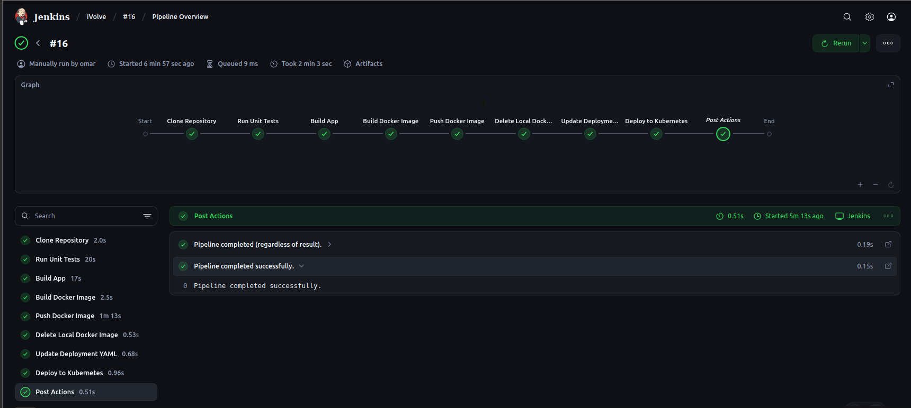
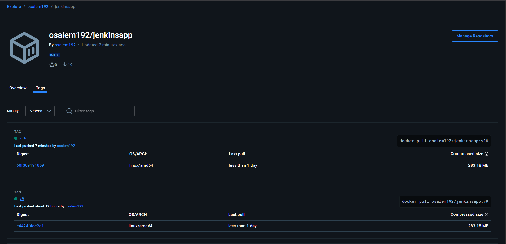
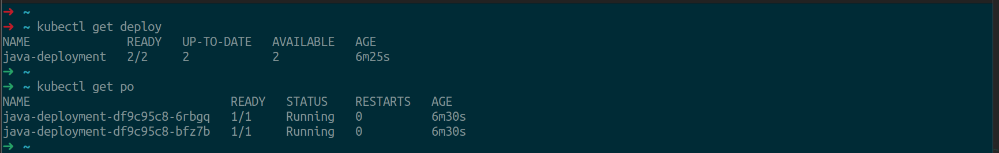

# Jenkins CI/CD Pipeline Documentation

This document explains the Jenkins pipeline defined in the `Jenkinsfile` for Lab34. The pipeline automates the process of building, testing, containerizing, and deploying a Java application to Kubernetes. Visual references are provided using the images in the `Images/` directory.

---

## Pipeline Overview

The pipeline consists of the following stages:

1. **Clone Repository**
2. **Run Unit Tests**
3. **Build App**
4. **Build Docker Image**
5. **Push Docker Image**
6. **Delete Local Docker Image**
7. **Update Deployment YAML**
8. **Deploy to Kubernetes**



---

## Stage Details

### 1. Running Jenkins as Container

```sh
docker run --privileged --network=host -p 8080:8080 -p 50000:50000 -v ~/Desktop/jenkins_data:/var/jenkins_home -v /var/run/docker.sock:/var/run/docker.sock -v /usr/bin/docker:/usr/bin/docker --name jenkins_container jenkins/jenkins:jdk21
```
#### After that to use docker inside jenkins container:
```sh
docker exec -it -u root jenkins
```
then inside the container
```sh
groupadd -g 999 docker
usermod -aG docker jenkins
```
and to use kubectl inside jenkins container:
```sh
curl -LO "https://dl.k8s.io/release/$(curl -L -s https://dl.k8s.io/release/stable.txt)/bin/linux/amd64/kubectl"

install -o root -g root -m 0755 kubectl /usr/local/bin/kubectl
```


### 1. Clone Repository
- **Description:** Clones the source code from the GitHub repository (`main` branch).
- **Jenkinsfile:**
  ```groovy
  git branch: 'main', url: 'https://github.com/osalem192/Jenkins_App.git'
  ```

### 2. Run Unit Tests
- **Description:** Runs unit tests using Maven to ensure code quality.
- **Jenkinsfile:**
  ```groovy
  withMaven(maven: 'Maven') {
      sh "mvn test"
  }
  ```

### 3. Build App
- **Description:** Builds the Java application using Maven, producing a JAR file.
- **Jenkinsfile:**
  ```groovy
  withMaven(maven: 'Maven') {
      sh "mvn package"
  }
  ```

### 4. Build Docker Image
- **Description:** Builds a Docker image for the application using the generated JAR file.
- **Jenkinsfile:**
  ```groovy
  sh "docker build -t ${IMAGE_NAME}:${IMAGE_TAG} ."
  ```

### 5. Push Docker Image
- **Description:** Pushes the Docker image to Docker Hub using stored credentials.
- **Jenkinsfile:**
  ```groovy
  withCredentials([usernamePassword(credentialsId: 'docker_credentials', ...)]) {
      sh "docker push ${IMAGE_NAME}:${IMAGE_TAG}"
  }
  ```
- **Visual Reference:**
  

### 6. Delete Local Docker Image
- **Description:** Removes the Docker image from the local environment to save space.
- **Jenkinsfile:**
  ```groovy
  sh "docker rmi ${IMAGE_NAME}:${IMAGE_TAG}"
  ```

### 7. Update Deployment YAML
- **Description:** Updates the Kubernetes deployment YAML file to use the new Docker image tag.
- **Jenkinsfile:**
  ```groovy
  sh "sed -i 's|image:.*|image: ${IMAGE_NAME}:${IMAGE_TAG}|' deployment.yaml"
  ```

### 8. Deploy to Kubernetes
- **Description:** Applies the updated deployment YAML to the Kubernetes cluster using a provided kubeconfig file.
- **Jenkinsfile:**
  ```groovy
  withCredentials([file(credentialsId: 'kubeconfig', variable: 'KUBECONFIG_FILE')]) {
      sh '''
      export KUBECONFIG=$KUBECONFIG_FILE
      kubectl apply -f deployment.yaml
      '''
  }
  ```
- **Visual Reference:**
  

---

## Post Actions
- **always:** Prints a message when the pipeline completes, regardless of the result.
- **success:** Prints a message when the pipeline succeeds.
- **failure:** Prints a message when the pipeline fails.

---

## Summary
This Jenkins pipeline automates the full CI/CD process for a Java application, from code checkout to deployment on Kubernetes, with Docker image management and secure credential handling. The included images provide visual confirmation of successful pipeline execution and deployment. 