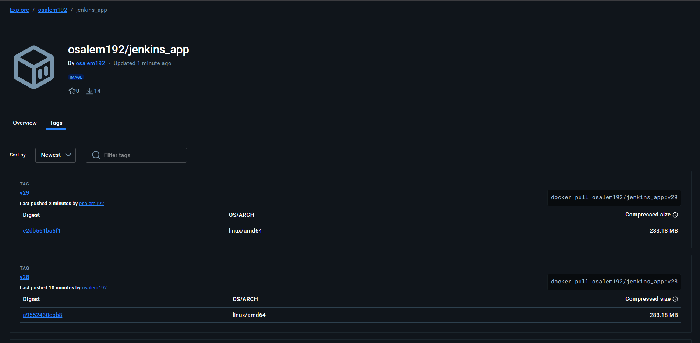

# Lab 35: CI/CD Pipeline Implementation with Jenkins Agents and Shared Libraries

## Overview
This lab demonstrates a complete CI/CD pipeline using Jenkins, Docker, and Kubernetes, leveraging Jenkins agents and a shared library for reusable pipeline steps. The pipeline automates the process of building, testing, containerizing, and deploying a Java application.

## Prerequisites
- Jenkins server with agent/slave configured
- Docker and Kubernetes clusters accessible from Jenkins
- DockerHub account and credentials stored in Jenkins as `docker_credentials`
- Jenkins Shared Library named `iVolve_sharedLiberary` configured
- Access to the [Jenkins_App repository](https://github.com/osalem192/Jenkins_App.git)

## Pipeline Stages
The pipeline defined in the `Jenkinsfile` consists of the following stages:

1. **Clone Repository**
   - Clones the application source code from the specified GitHub repository.
2. **Run Unit Tests**
   - Executes unit tests to ensure code quality and correctness.
3. **Build App**
   - Compiles/builds the application.
4. **Build and Push Docker Image**
   - Builds a Docker image for the application and pushes it to DockerHub using the provided credentials.
5. **Delete Local Docker Image**
   - Removes the Docker image from the Jenkins agent to save space.
6. **Update Deployment YAML**
   - Updates the Kubernetes deployment YAML file with the new image tag.
7. **Deploy to Kubernetes**
   - Deploys the updated application to the Kubernetes cluster using the provided kubeconfig.

## Shared Library Usage
All major steps in the pipeline use functions from the shared library `iVolve_sharedLiberary`, promoting code reuse and maintainability. Example functions include `cloneRepo`, `runUnitTests`, `buildApp`, `buildAndPushDockerImage`, `deleteLocalDockerImage`, `updateDeploymentYaml`, and `deployToKubernetes`.

## Pipeline Visualization
Below is a sample image showing the DockerHub repository after a successful image push:

## How to Run
1. Ensure all prerequisites are met and Jenkins is configured with the required shared library and credentials.
2. Place the provided `Jenkinsfile` in your Jenkins pipeline project.
3. Trigger the pipeline. Monitor each stage for successful completion.
4. After the pipeline runs, verify the image in DockerHub and the deployment in your Kubernetes cluster.
