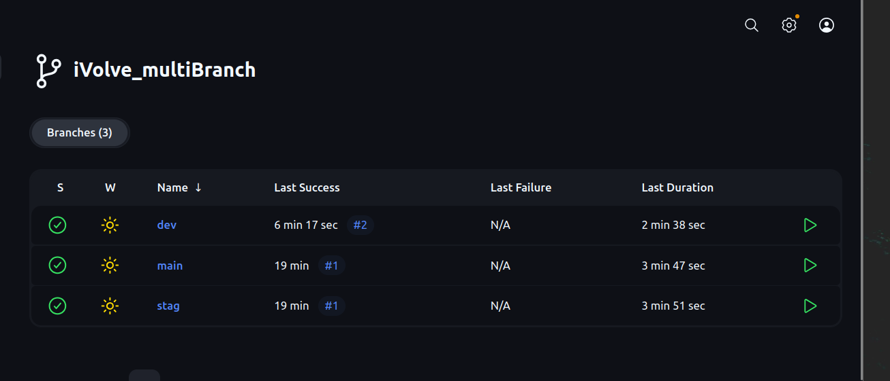
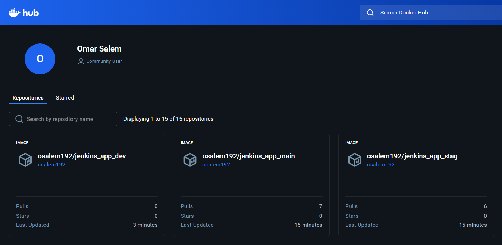
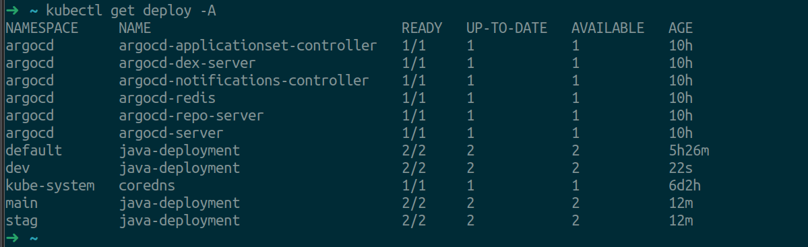

# Lab 36: Multi-branch CI/CD Workflow

## Overview
This lab demonstrates a multi-branch CI/CD pipeline using Jenkins, Docker, and Kubernetes. The pipeline automates building, testing, containerizing, and deploying an application to different Kubernetes namespaces based on the GitHub branch (main, stag, dev).

## Steps

1. **Clone the Dockerfile**
   - Clone the Dockerfile from [Jenkins_App GitHub Repo](https://github.com/Ibrahim-Adel15/Jenkins_App.git).

2. **Push to Your Repo & Create Branches**
   - Push the Dockerfile to your own repository.
   - Create three branches: `main`, `stag`, and `dev`.

3. **Create Kubernetes Namespaces**
   - In your Kubernetes environment, create three namespaces:
     - `main`
     - `stag`
     - `dev`

4. **Jenkins Multibranch Pipeline**
   - Configure a Jenkins multibranch pipeline to automate deployment to the namespace matching the branch name.
   - The pipeline uses a [shared library](https://www.jenkins.io/doc/book/pipeline/shared-libraries/) for reusable steps.

5. **Jenkins Agent/Slave**
   - Set up a Jenkins agent (slave) to run the pipeline jobs.

6. **Pipeline Workflow**
   - The Jenkinsfile defines the following stages:
     1. **Clone Repository**: Clones the application source code.
     2. **Run Unit Tests**: Executes unit tests.
     3. **Build App**: Builds the application.
     4. **Build and Push Docker Image**: Builds a Docker image and pushes it to Docker Hub.
     5. **Delete Local Docker Image**: Cleans up the local Docker image.
     6. **Update Deployment YAML**: Updates the Kubernetes deployment manifest with the new image tag.
     7. **Deploy to Kubernetes**: Deploys the application to the appropriate namespace based on the branch.

## Pipeline Diagram

Below are visual representations of the workflow:

### Jenkins Multibranch Pipeline


### Docker Image Push to DockerHub


### Kubernetes Deployment


## Jenkinsfile Example

```
@Library('iVolve_sharedLiberary') _
pipeline {
    agent any
    environment {
        namespace = "${env.GIT_BRANCH}"
        IMAGE_NAME = "osalem192/jenkins_app_${namespace}"
        IMAGE_TAG = "v${env.BUILD_ID}"
    }
    stages {
        stage('Clone Repository') {
            steps {
                cloneRepo(branch: 'main', url: "https://github.com/osalem192/Jenkins_App.git")
            }
        }
        stage('Run Unit Tests') {
            steps {
                runUnitTests()
            }
        }
        stage('Build App') {
            steps {
                buildApp()
            }
        }
        stage('Build and Push Docker Image') {
            steps {
                buildAndPushDockerImage(credentials: "docker_credentials", imageName: "${IMAGE_NAME}", imageTag: "${IMAGE_TAG}")
            }
        }
        stage('Delete Local Docker Image') {
            steps {
                deleteLocalDockerImage(imageName: "${IMAGE_NAME}", imageTag: "${IMAGE_TAG}")
            }
        }
        stage('Update Deployment YAML') {
            steps {
                updateDeploymentYaml(imageName: "${IMAGE_NAME}", imageTag: "${IMAGE_TAG}")
            }
        }
        stage('Deploy to Kubernetes') {
            steps {
                deployToKubernetes("kubeconfig", namespace)
            }
        }
    }
}
```

## Notes
- Ensure your Jenkins instance has access to Docker and your Kubernetes cluster.
- Store DockerHub credentials securely in Jenkins.
- The shared library (`iVolve_sharedLiberary`) must be configured in Jenkins.
- Adjust image names and namespaces as needed for your environment. 