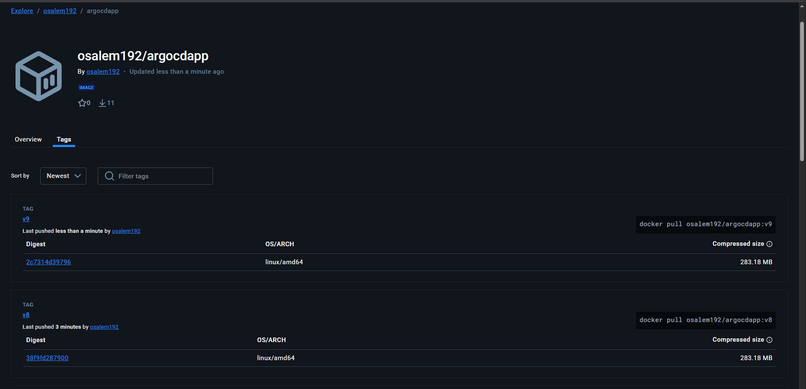
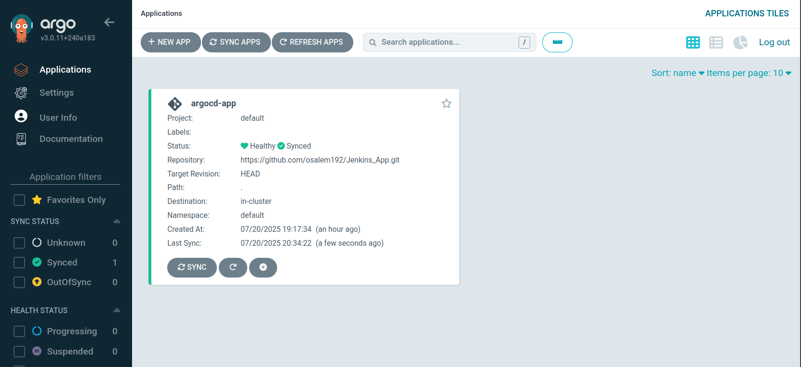
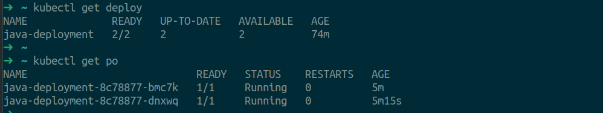

# Lab 37: GitOps Workflow with ArgoCD, Jenkins, and Docker

## Overview
This lab demonstrates a GitOps workflow using ArgoCD in your Kubernetes cluster. The workflow automates the process of building, containerizing, and deploying an application using Jenkins, Docker, and ArgoCD.

## Workflow Steps

1. **Configure ArgoCD** in your Kubernetes cluster.
2. **Clone the Docker file** from: [Jenkins_App GitHub Repo](https://github.com/Ibrahim-Adel15/Jenkins_App.git)
3. **Create a Jenkins pipeline** that automates the following processes:
    1. Build the applicatioSSJn
    2. Build the Docker image
    3. Push the image to Docker Hub
    4. Delete the image locally
    5. Edit the new image tag in `deployment.yaml`
    6. Push the updated files to the GitHub repository
4. **Validate** that ArgoCD deploys the new app into the cluster.

---

## Jenkins Pipeline Breakdown
The provided `Jenkinsfile` automates the following steps:

1. **Clone Repository**
    - Clones the application source code from the GitHub repository.
2. **Run Unit Tests**
    - Executes unit tests using Maven.
3. **Build App**
    - Packages the application using Maven.
4. **Build Docker Image**
    - Builds a Docker image with a unique tag for each build.
5. **Push Docker Image**
    - Authenticates to Docker Hub and pushes the image.
6. **Delete Local Docker Image**
    - Removes the Docker image from the local environment to save space.
7. **Update Deployment YAML**
    - Updates the `deployment.yaml` file with the new image tag using `sed`.
8. **Push to GitHub**
    - Commits and pushes the updated `deployment.yaml` to the GitHub repository.

---

## Pipeline Diagram

Below is a visual representation of the workflow:

```
Developer → GitHub → Jenkins → DockerHub → GitHub (K8s manifests) → ArgoCD → K8s Cluster
```

---

## Example Images

### 1. DockerHub Image Push


### 2. ArgoCD Deployment Result


### 3. Kubernetes Deployment


---

## Validation
- After the pipeline completes, ArgoCD will detect the changes in the GitHub repository and automatically deploy the new version of the application to the Kubernetes cluster.
- You can validate the deployment by checking the ArgoCD dashboard and the application status in the cluster.

---

## Notes
- Ensure Jenkins has the required credentials for Docker Hub and GitHub.
- The `deployment.yaml` file must exist in the repository root for the pipeline to update the image tag.
- ArgoCD should be configured to watch the repository for changes to the deployment manifests. 