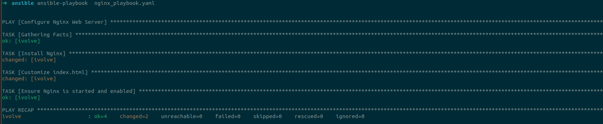
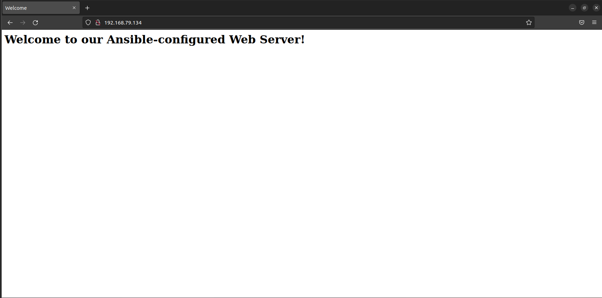

# Lab5 Ansible Playbook for Web Server Configuration

## Overview
This document outlines the steps to create and use an Ansible playbook to automate the configuration of a web server using Nginx. The playbook will handle the installation of Nginx, customization of the web page, and verification of the configuration on a managed node.

## Tasks
#### 1. **Write an Ansible playbook to automate the configuration of a web server.**
   - The playbook will define tasks to install and configure Nginx.
#### 2. **Install Nginx.**
   - Ensure Nginx is installed and running on the target node.
#### 3. **Customize the web page.**
   - Create and configure a custom HTML file to be served by Nginx.
#### 4. **Verify the configuration on managed node.**
   - Check that the web server is running and serving the custom page correctly.

## Playbook Details
####  **File Name**: `nginx_playbook.yaml`
#### **Tasks**:
  - Install Nginx package.
  - Copy a custom index.html file to the web server directory.
  - Start and enable the Nginx service.
  - Verify the configuration by checking the service status.

## Usage
#### 1. Ensure Ansible is installed on the control node.
#### 2. Update the inventory file with the managed node's IP address.
#### 3. Run the playbook using the command: 

```bash
ansible-playbook nginx_playbook.yml
```




### Verify the web page by accessing the managed node's IP in a browser.


