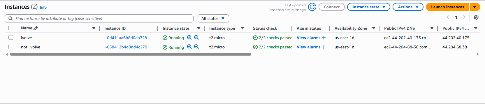
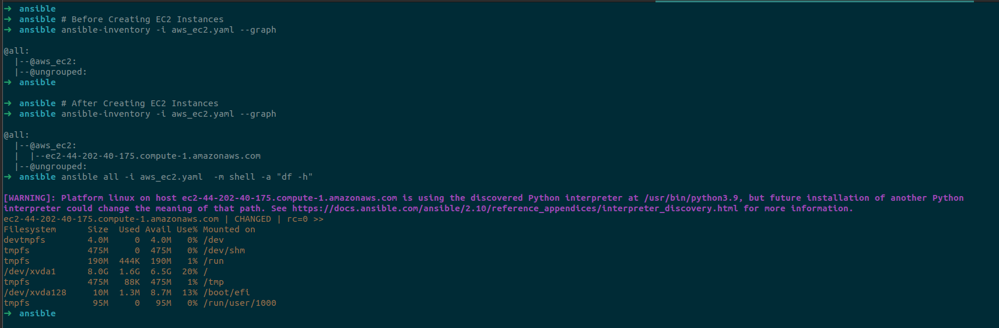

# Ansible Dynamic Inventories Lab

## Overview
This lab focuses on setting up Ansible dynamic inventories to manage AWS EC2 instances with the tag `name:ivolve`.

## Lab Objectives
- Create AWS EC2 with tag `name:ivolve`.
- Set up Ansible dynamic inventories to automatically discover and manage running EC2s with tag `name:ivolve`.
- List the target hosts in Dynamic inventory using the `ansible-inventory` command.

## Prerequisites
- AWS account with EC2 access.
- Ansible installed on the control node.
- AWS CLI configured with appropriate permissions.

## Steps

### 1. Create AWS EC2 with Tag `name:ivolve`
#### Launch an EC2 instance in AWS with Tag `Name: ivolve`.




### 2. Set Up Ansible Dynamic Inventories
- Install the required AWS SDK for Python (`boto3`) on the Ansible control node:
  ```bash
  pip install boto3
  ```
- Configure AWS credentials using 
  ```bash
  aws configure
  ```
  Enter Access Key and secret Access Key.

- Create a file for the dynamic inventory called `aws_ec2_inventory.py` and add the following.
  ```
  plugin: aws_ec2
  regions:
    - us-east-1                # Replace with your region
  filters:
    tag:Name: ivolve           # Match EC2s with tag Name=ivolve
  host_key_checks: False
  ```


- Update the Ansible configuration file (`ansible.cfg`) to use the dynamic inventory script:
  ```
  [defaults]
  inventory = ~/ansible/aws_ec2_inventory.yaml
  ```
- Ensure the `aws_ec2` inventory plugin is enabled and configured to filter instances by the tag `name:ivolve`.

### 3. List Target Hosts in Dynamic Inventory
- Run the following command to list the target hosts:
  ```bash
  ansible-inventory --graph   
  ```
- Verify that the output includes the EC2 instances with the tag `name:ivolve`.
### 4. Apply Commands or Playbooks such as the Following Ad-Hoc Command: 
```bash
ansible all -m shell -a "df -h"
```




## Notes
**Ensure that EC2 Key called `Lab_key.pem` exists in the working directory.**