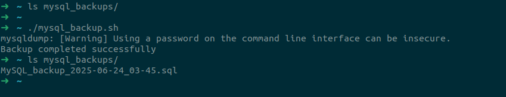

# MySQL Database Backup Script

## Overview
This project creates a shell script to automate MySQL database backups using `mysqldump` and schedules it to run daily at 5:00 PM using `crontab`.

## Objective

The goal of this lab is to:

1. Install a MySQL database.
2. Create a directory to store backups.
3. Write a shell script to automate the backup process using `mysqldump`.
4. Schedule the script to run daily at 5:00 PM using `cron`.

## Requirements
- `MySQL` database installed.
- `mysqldump` utility available.
- `Cron` service enabled.

## Steps to Set Up

### 1. Install MySQL Database
#### Ubuntu
``` bash
sudo apt install mysql-server
```
#### RedHat
``` bash
sudo yum install mysql-server
```

### 2. Create Backup Directory

`this step can be discarded as the script will create the directory if it's not created `

Create a new directory to store the backups:
```bash
mkdir /path/to/backup
```
### 4. Create User To Take Backup

#### login to mysql using root user
```bash
sudo mysql -u root -p
```
#### then create a user with privelages
```mysql
CREATE DATABASE testdb;
CREATE USER 'backupuser'@'localhost' IDENTIFIED BY 'Backup@123456789_Root';
GRANT ALL PRIVILEGES ON testdb.* TO 'backupuser'@'localhost';
FLUSH PRIVILEGES;
EXIT;
```
 ` this step (Create User To Take Backup) can be discarded and root user could be used directly in next steps but it's not recommended `


### 3. Create Shell Script
A shell script is created to take a backup from the MySQL database using `mysqldump` and store it in the backup directory with a filename including the current date.

#### Script Content
Create a file named `mysql-backup.sh`:

```bash
#!/bin/bash

BACKUP_DIR="$HOME/mysql_backups"
DATE=$(date +\%F_\%H-\%M)
DB_NAME="testdb"
USER="backupuser"
#db_pass is a global variable defined outside of the script

#checking whether the directory exists and if not, it will be created
if [ -d $BACKUP_DIR ]
then
:
else
        mkdir -p "$BACKUP_DIR"
fi

mysqldump --no-tablespaces -u $USER -p"$db_pass"  $DB_NAME$ > "$BACKUP_DIR/MySQL_backup_$DATE.sql"

#checking whether the command completed successfully
if [ $? -eq 0 ]
then
        echo "Backup completed successfully"
else
        echo "Bakcup failed"
fi
```

- Replace `[BACKUP_DIR]` with the backup directory.
- Replace , `[USER]`, `[DB_NAME]`, and `[db_pass]` with your MySQL credentials and database name.
- Make the script executable:
  ```bash
  chmod +x mysql-backup.sh
  ```

### 4. Manual execution Results



### 5. Set Cron Job
Schedule the script to run every day at 5:00 PM using `crontab`:
```bash
crontab -e
```
Add the following line:
```
0 17 * * * /path/to/mysql_backup.sh
```
#### Crontab Result

