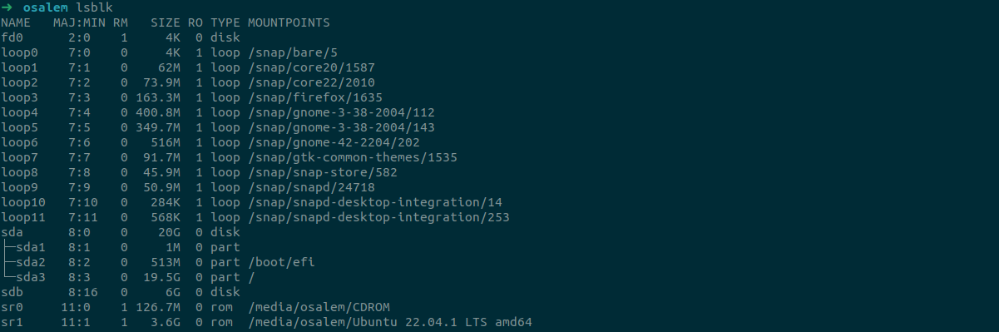
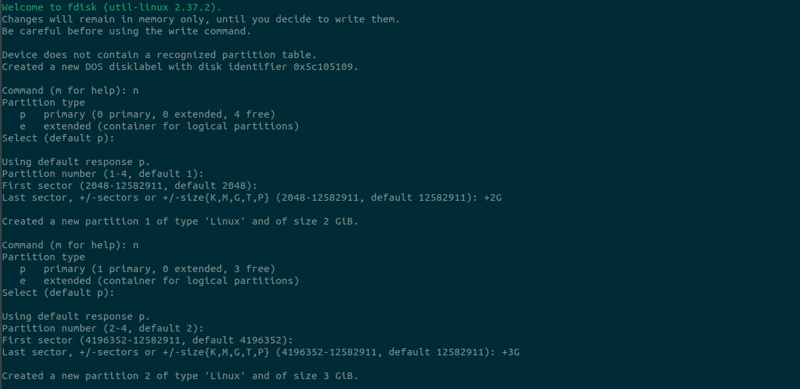
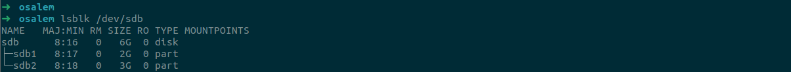
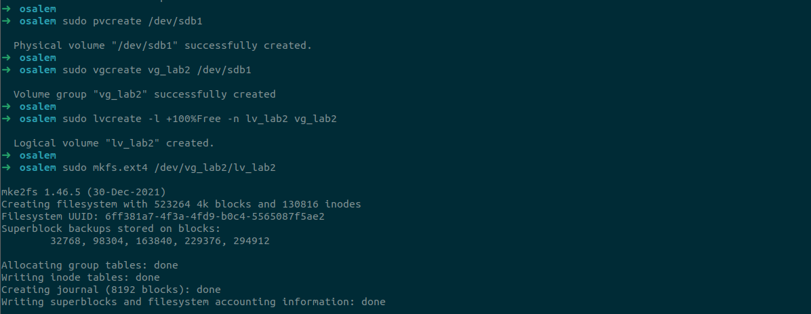
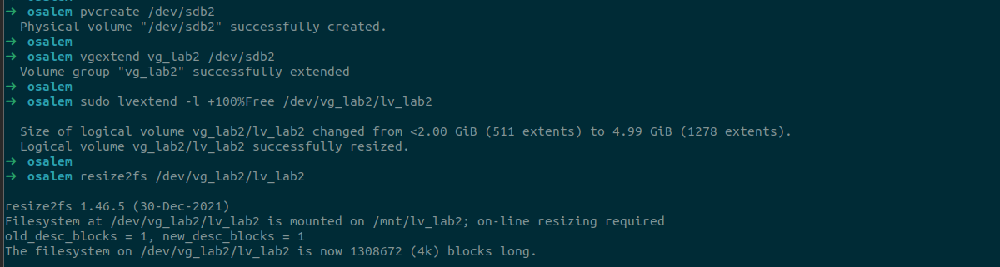

# Lab 2: Disk Management and Logical Volume Setup

## Overview
This documentation outlines the setup of a 6 GB virtual disk in a Linux environment.

## Objective
- Attach a new 6 GB disk to your virtual machine.
- Creating two partitions: 2 GB and 3 GB.
- Initialize the 2 GB partition as a Volume Group (VG) and create a Logical Volume (LV) within it.
- Extend the Logical Volume by adding the 3 GB partition to the existing Volume Group.

## Steps Performed

### 1. Disk Attachment Verfication
A new 6 GB disk (`/dev/sdb`) was attached to the virtual machine.




### 2. Create partitions
Using fdisk to create two paritions:

``` bash
sudo fdisk /dev/sdb
``` 
Inside fdisk:

- Press `n` → create new partition → choose default values → set size +2G

- Press `n` again → second partition → set size +3G

- Press `t` → change both types to 8e (Linux LVM)

- Press `w` to write changes

#### Output



#### Two partitions were created using fdisk:
- `/dev/sdb1`: 2 GB
- `/dev/sdb2`: 3 GB




### 3. Initialize Volume Group and Create Logical Volume
Initialized the 2 GB partition (`/dev/sdb1`) as a Volume Group named `vg_lab2`:
```bash
sudo pvcreate /dev/sdb1
sudo vgcreate vg_lab2 /dev/sdb1
```

Created a Logical Volume (`lv_lab2`) using 100% of the free space within `vg_lab2`:

```bash
sudo lvcreate -l +100%FREE -n lv_lab2 vg_lab2
```

Formatted the Logical Volume with ext4 filesystem:

```bash
sudo mkfs.ext4 /dev/vg_lab2/lv_lab2
```
#### Output




Created a mount point and mounted the Logical Volume:

```bash
sudo mkdir /mnt/lv_lab2
sudo mount /dev/vg_lab2/lv_lab2 /mnt/lv_lab2
```

Verified the mount:

```bash
lsblk /dev/sdb
```

#### Output:


### 4. Extend Logical Volume

Initialized the 3 GB partition (`/dev/sdb2`) as a physical volume:

```bash
sudo pvcreate /dev/sdb2
```

Extended the Volume Group `vg_lab2` to include `/dev/sdb2`:

```bash
sudo vgextend vg_lab2 /dev/sdb2
```
Extended the Logical Volume `lv_lab2` to use 100% of the free space:

```bash
sudo lvextend -l +100%FREE /dev/vg_lab2/lv_lab2
```
Resized the filesystem to reflect the new size:

```bash
sudo resize2fs /dev/vg_lab2/lv_lab2
```
#### Output

 


## Final Result
  ```bash
  df -hT
  ```


## Conclusion
The Logical Volume `lv_lab2` was successfully created with an initial size of 2 GB and extended to 4.9 GB by adding the 3 GB partition. The filesystem was resized online, and the volume is now mounted at `/mnt/lv_lab2`.