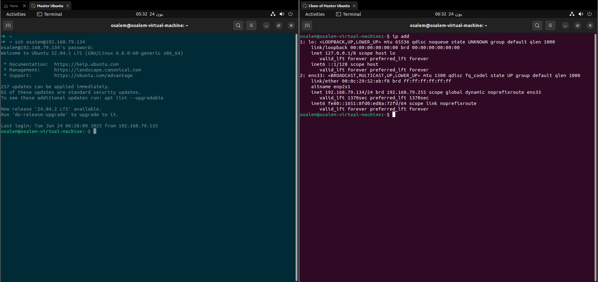
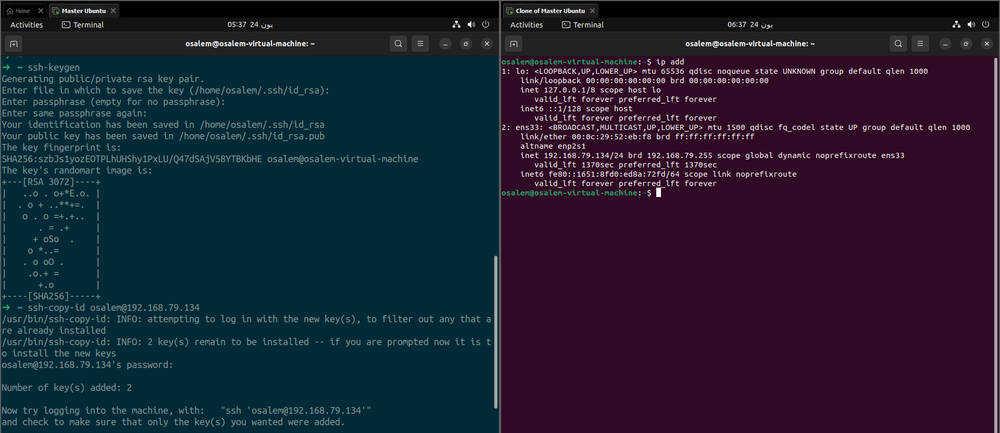
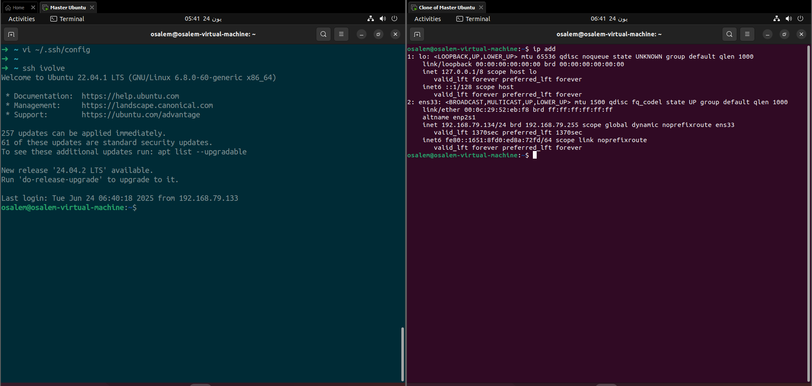

# SSH Configurations Lab Guide

## Overview
This guide provides step-by-step instructions for configuring SSH (Secure Shell) to enable secure access to a remote machine using public and private key pairs.

## Objective
- Generate `Public and Private Key`.
- use `ssh-copy-id `Command
- configure ssh just to run `ssh ivolve` to access remote machines

## Steps

### 1. Accessing The Target Machine with Password


### 1. Generate Public & Private Keys in Your Local Machine
- Use the `ssh-keygen` command to generate a new pair of keys.

- This will create a private key (`id_rsa`) and a public key (`id_rsa.pub`) in the `~/.ssh/` directory.

### 2. Securely Transfer the Public Key to Another Machine Using `ssh-copy-id` Command
- Use the `ssh-copy-id` command to copy the public key to the remote machine.
- Example: `ssh-copy-id user@remote_host`
- in my case the user=`osalem` and the remote_host=`192.168.79.134`
- You may be prompted to enter the remote user's password for the first time.

### Image for generating the transfaring the key



### 3. Configure SSH to Just Run `ssh ivolve` to Access the Remote Machine
- Edit or create the SSH configuration file located at `~/.ssh/config`.
- Add the following entry:

```
Host ivolve
    HostName remote_host
    User username
    IdentityFile ~/.ssh/id_rsa
```
- Replace `remote_host` with the actual IP address or hostname of the remote machine.
- Replace `username` with your remote username.
- Save the file and set appropriate permissions: `chmod 600 ~/.ssh/config`.
- Now, you can simply run `ssh ivolve` to connect to the remote machine.

#### in my case: 
```
Host ivolve
    HostName 192.168.79.134
    User osalem
    IdentityFile ~/.ssh/id_rsa
```




## Notes
Ensure the remote machine's SSH server is running and accessible (try using ping).
